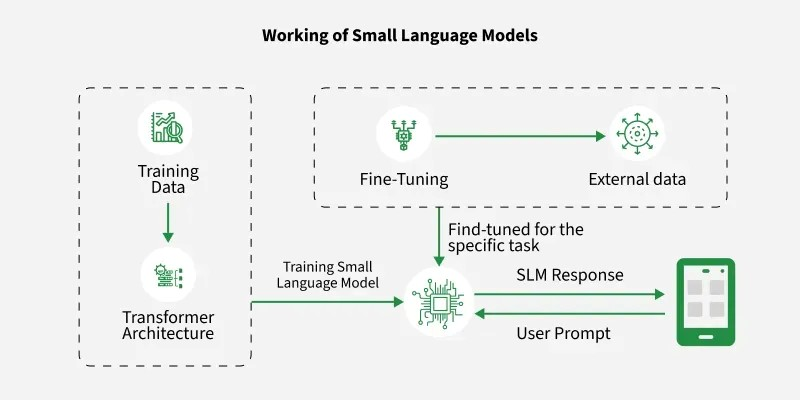

+++
title = "Small Language Models (SLMs): The Future of Efficient AI"
date = 2026-04-22
description = "A quick look at Small Language Models (SLMs) and how they enable faster, cheaper, and more efficient AI, along with the key techniques driving their growing impact."
[extra]
author = "Shrika Neeharika C"
+++

If you’ve been following the world of artificial intelligence, you’ve probably heard a lot about Large Language Models. Have you ever wondered about the little siblings of these AI giants, Small Language Models? Let’s dive into why SLMs are becoming the unsung heroes of efficient AI.
Artificial Intelligence is evolving rapidly, and while large models like GPT-4 dominate headlines, a quieter revolution is happening with Small Language Models. These lightweight yet powerful models are reshaping how AI is deployed, making it faster, cheaper, and more accessible than ever before.

# What Are Small Language Models?
Small Language Models are compact AI models designed to understand and generate human language. Unlike large models that require massive computational resources, SLMs are optimized for efficiency, speed, and local deployment.

# How Do SLMs Work?
At their core, SLMs are built on the same principles as larger models, primarily the Transformer Architecture. They process text by breaking it into tokens, understanding context through attention mechanisms, and predicting meaningful outputs.

They incorporate several important modifications to improve efficiency. One key change is the reduction in depth and width, where SLMs use fewer layers and smaller hidden dimensions to lower computational requirements while maintaining performance through careful design. They also adopt more efficient attention mechanisms, since traditional self-attention has quadratic complexity. Techniques such as Multi-Query Attention (MQA), Grouped Query Attention (GQA), and Sliding Window Attention help reduce memory usage and computational cost without significantly compromising accuracy. Additionally, SLMs utilize compact embeddings by employing smaller vocabularies and sharing weights between input and output embeddings, which further minimizes the number of parameters and speeds up both training and inference.

# Knowledge Distillation 
If SLMs are the "little siblings," Knowledge Distillation is their intensive tutoring program. Rather than training a small model from scratch on raw data, researchers often use a Teacher-Student framework.

In this process:
- The Teacher: A massive LLM (like GPT-4 or Llama-3-70B) that has already mastered the nuances of language.
- The student: A compact SLM that learns by mimicking the Teacher’s output patterns and internal reasoning, rather than just looking at the final "correct" answer.

By learning from the Teacher's "soft labels" (the probability it assigns to different words), the student model can capture complex linguistic patterns and logic that it might have missed if it were learning on its own. This is how models like DistilBERT achieve 97% of BERT’s performance while being 40% smaller and 60% faster.

# Emerging Trends in SLM Research
## Mixture of Experts (MoE):
Mixture of Experts is an approach where the model is divided into multiple smaller sub-networks, called “experts,” and only a few of them are activated for each input. Instead of using the entire model every time, a routing mechanism decides which experts are most relevant for a given task. This makes computation more efficient while still allowing the model to scale in capability, as it can have many experts without incurring the full computational cost.
## Recursive Reasoning Models:
Recursive reasoning models focus on improving problem-solving without increasing model size. Instead of adding more layers, these models process information in multiple steps, refining their output iteratively. This allows smaller models to handle complex reasoning tasks by “thinking” through a problem in stages, making them more capable without requiring additional parameters.
## Hardware-Aware Training:
Hardware-aware training involves designing and training models with specific hardware constraints in mind, such as mobile processors, GPUs, or edge AI chips. By optimizing for factors like memory bandwidth, parallelism, and power consumption during training, these models run more efficiently during deployment. This ensures better performance, lower latency, and reduced energy usage when SLMs are used on real-world devices like smartphones and IoT systems.

# The Future of SLMs
The future of SLMs centres on personalized AI assistants and integration into wearables and IoT for smarter, real-time experiences. There is also a strong focus on energy-efficient and sustainable AI systems. Additionally, real-time decision-making is improving the performance of autonomous systems. As hardware improves and optimization techniques advance, SLMs will become even more capable, blurring the line between small and large models.
The future of AI lies in combining Small Language Models and Large Language Models into hybrid systems that balance efficiency and intelligence. SLMs will handle fast, on-device tasks like voice commands and personalization, while LLMs will manage complex reasoning and deep analysis through the cloud. This collaboration will enable smarter, real-time applications across smartphones, healthcare, autonomous systems, and enterprise tools, making AI more accessible, cost-effective, and privacy-focused. Ultimately, the synergy between SLMs and LLMs will define the next generation of scalable and intelligent AI solutions.
