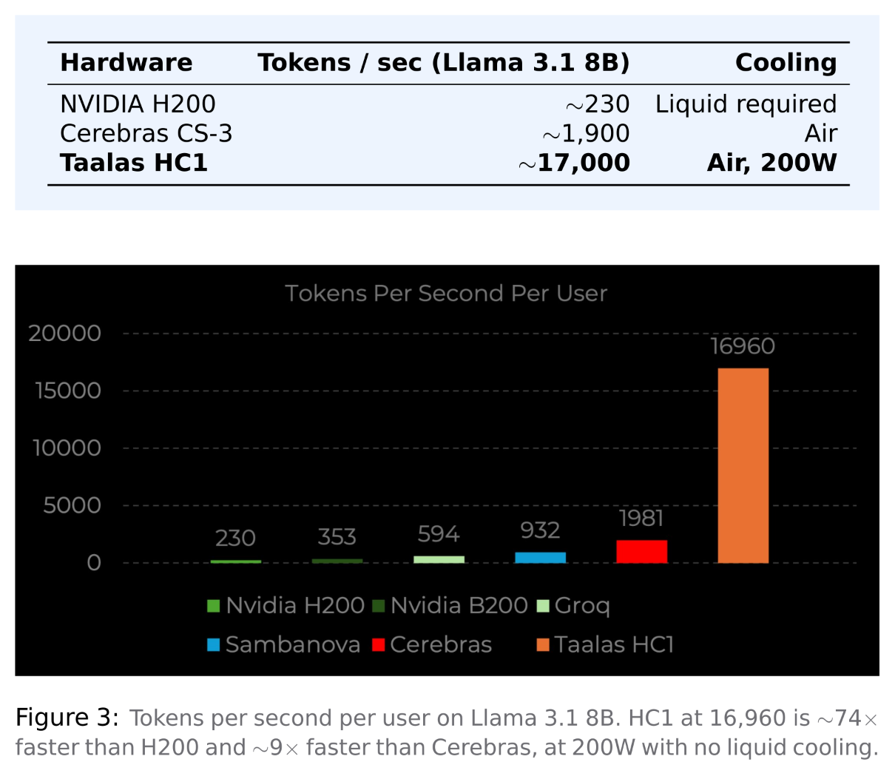

+++
title = "What If the AI Model Was the Computer? Meet Taalas HC1"
date = 2025-03-26
description = "There’s a problem that doesn’t get enough attention in AI inference. It’s not the model or the algorithm. It’s the connection between memory and compute."
[extra]
author = "Raghul S"
+++

There’s a problem that doesn’t get enough attention in AI inference. It’s
not the model or the algorithm. It’s the connection between memory
and compute.

Every time a GPU generates a token, it fetches billions of parameters
from High Bandwidth Memory, moves them across a bus to the com-
pute cores, performs the calculations, and sends the results back. This
process happens billions of times every second. The movement of data
alone makes up **80 to 90% of energy use**. The actual computation is
nearly an afterthought. This issue is known as the **Memory Wall**, and
it explains why AI inference is expensive, consumes a lot of power, and
is slower than the hardware could be.

Taalas, a Canadian startup founded in 2023 by former AMD GPU archi-
tect Ljubisa Bajic, suggested a solution so radical it sounds like a joke:
get rid of the memory entirely.

# The Von Neumann Problem
Every computing device made in the last 70 years relies on Von Neu-
mann architecture. Memory and processing power are separate. Data
travels between them. This movement creates a bottleneck.
 
On an H200, running Llama 3.1 8B means going through the fetch-
execute cycle for each weight and token. First, fetch the weight from
HBM. Then, move it across the bus. Multiply the values. Finally, move
the result back. This involves 8 billion parameters and happens billions
of times for each token. Studies show that 80 to 90% of GPU inference
energy is used for data movement, not computation. The silicon often
waits for the data to arrive.

Taalas didn’t optimize for the Memory Wall; they eliminated it.

# The Mask ROM Recall Fabric

In standard ROM, a memory cell consists of a single transistor. It is
either connected to ground, representing 0, or disconnected, represent-
ing 1. This state is set permanently during fabrication. The memory is
infinitely readable and never writable. It is the densest and fastest type
of memory in digital electronics.

Taalas took this concept further. They introduced a way to store a 4-bit
weight and perform the related multiplication using just one transistor.

>One transistor. Four bits. One multiply. Done.
>Storage and computation become one physical event. The signal
>does not fetch the weight and then compute — the computation
>occurs as the signal travels through the transistor that encodes the
>weight.

In traditional designs, weight storage and computation are completely
separate. You need separate transistors for the memory cell, the regis-
ter, the ALU, and the connections between these components. Taalas
merged all of this into a single physical structure. The signal does not
fetch the weight and then compute. Instead, the computation occurs as
the signal travels through the transistor that encodes the weight. Stor-
age and computation become one physical event.

The HC1 has 53 billion transistors on an 815mm² die, manufactured
using TSMC’s 6nm N6 process. Almost every transistor serves as both
a weight and a computation unit. There is no general-purpose logic,
no instruction decoder, and no extra programmability overhead. The
entire die directly represents Llama 3.1 8B’s computational graph.
What Happens During Inference

When you send a prompt, the input tokens get embedded and fed into
the chip’s dataflow. For each of Llama 3.1 8B’s 32 transformer layers,
the attention mechanism and feed-forward network compute directly
through the hardwired recall fabric. The weight matrices for Query, Key,
and Value projections are physically etched into the transistors. The
multiply operation occurs as the signal flows through. There is no fetch-
ing or bus transfer. The result is available immediately.

The KV cache and LoRA fine-tuning adapters reside in a separate SRAM
fabric on the same die. This is the only dynamic part of the architecture.
Static base weights are in mask ROM while dynamic context is in SRAM.
They combine in the attention computation without ever leaving the
chip.

3Llama 3.1 8B at INT4 quantization requires about 4GB of weight storage.
With one transistor for every 4-bit weight across 53 billion transistors,
it fits with space left for SRAM, routing, and control logic. Taalas maxed
out the die size to the reticle limit on purpose to fit as many parameters
as possible.

# The Numbers

The HC1 delivers about 17,000 tokens per second for each user on
Llama 3.1 8B. An H200 operates at around 230. Cerebras, which uses a
unique SRAM-heavy design to tackle the memory wall problem, achieves
about 1,900. The HC1 is roughly ten times faster than the next fastest
option. It draws 200W per card, runs in standard air-cooled racks, and
needs no liquid cooling.

# The Obvious Catch
The HC1 is built around one chip model (the Llama 3.1 8B). The
chips’ weights are fixed in the silicon; you cannot change them.
The HC1 is not a general purpose accelerator. It has one job; thus, it
is optimized for that one job, to maximize throughput for the specific
application. The economics of this model can be questioned because
the market changes so quickly, and thus investing in silicon that cannot
be modified sounds insane.

However, the answer provided by Taalas is genius. The layout of the
transistor array is common across all HC1 models — the only thing that
differs are the top two layers of metal. Taalas uses these layers to iden-
tify which of the transistors are at ground level, thereby indicating the
actual weight of the transistors. Taalas is able to take silicon and pro-
vide the PCIe card from a production run in about two months working
with TSMC; this makes not only seasonal hardware refresh feasible, but
enables rapid technology cycles.

# Why This Matters
The AI industry is shifting from being focused on training to being fo-
cused on inference, where the cost per token becomes the most impor-
tant measure at scale. In this scenario, the programmability burden of
a general purpose GPU becomes a drawback.

The HC1 is currently a prototype, not a product available for sale. The
benchmarks are self-reported. The HC2, which targets frontier mod-
els, is on the plan but is not yet functional. Fitting a 671B parameter
model like DeepSeek R1 would require roughly 30 synchronized tape-
outs, which is theoretically possible but operationally complex.
However, the architectural insight holds true regardless of whether Taalas
specifically succeeds. The memory wall is real. The energy cost of mov-
ing data is real. Taalas explored the path of specialization more than
anyone else was willing to go.

Whether this represents the future of inference or an intriguing dead end
depends on one factor: how quickly models continue to change.
That is a question no one can answer yet.