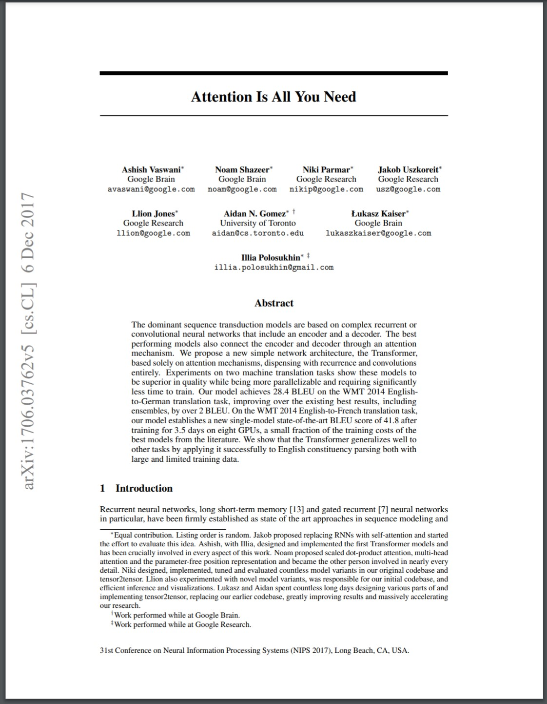

+++
title = "A Brief History of LLMs"
date = 2026-04-20
description = "Ever wondered how ChatGPT, Gemini, Claude and a ton of other agentic AI tools came into existence ? This post breaks down the history, architectural shifts and major milestones that shaped the AI landscape as we know it today."
[extra]
author = "R Uthaya Murthy"
author_link = "https://uthayamurthy.com"
+++

If you look at how we use AI today, from assistance in writing college assignments to coding assistants that help us build things in 24 hours that would earlier require months, it is really hard to believe how fast things have moved. These AI Systems are powered by AI Models called Large Language Models (or LLMs in short). While most of the world woke up to this wonderful tech on 30th November 2022, with the release of ChatGPT, the actual groundwork started years earlier. In this post, I will walk you through the brief history of Large Language Models, showing how we went from simple next word prediction systems to multi-agent systems of the modern era.

# RNNs to LSTMs: The Foundation of Language Modeling
Before we had the massive language models of today, the field of natural language processing relied heavily on Recurrent Neural Networks (RNNs). If you wanted a machine to understand a sentence, it had to read similar to how humans do, one word at a time, in order.

RNNs were designed with a looping mechanism that allowed them to pass information from one step to the next. This was a necessary step up from older models that treated words in isolation, but RNNs had a major flaw. They suffered from something similar to Amnesia. This short term memory loss problem was due to a technical issue known as the vanishing gradient problem. By the time the RNN reached the end of a long paragraph, it would already forget what the first sentence was about.

To fix this, researchers introduced Long Short-Term Memory networks (LSTMs). LSTMs added a system of internal gates that could regulate the flow of information, deciding which context to keep and which to throw away as it processed the text. This allowed the models to retain context over long stretches of text.

However, even with the improvements that LSTMs brought, the fundamental bottleneck still remained. Since they processed text sequentially, that is word by word, they were very slow to train. It wasn't possible to parallelize the work across multiple processors. This sequential nature meant there was a hard limit on how much data these models could learn from and how large they could scale. The field of NLP was stalled because of this architectural limitation and was waiting for something that could break this limitation.

# How "Attention" Revolutionized Natural Language Processing
In 2017, a team of researchers from Google published a paper titled "Attention Is All You Need". This paper introduced the Transformer architecture, which provided the exact solution needed to break the bottleneck that held back the previous language models. The Transformers completely discarded the sequential, word by word processing of RNNs and LSTMs.

Instead, the Transformers allow parallel processing during training, which significantly improves efficiency compared to sequential models like RNNs. Basically, it paid attention to longer sequences of text (say an entire sentence or paragraph) at the same time, which allowed it to capture subtle nuances from the text that would otherwise be lost if we looked at one word at a time. It accomplished this through a mechanism called "self attention". Self Attention allows the model to analyze every word in a sentence at the exact same time and determine which words are most relevant to each other, regardless of their physical distance in the text. 

Let's look at an example.
> "I didn't submit the assignment because the deadline for it was far away."

Here, "it" refers to assignment.

Now:

> "I didn't submit the assignment because I was lazy."

Here, "I" refers to me of course.

RNNs struggled with this sort of things. When there was more than one noun in a sentence, they struggled to associate the right one with the right pronoun. 
However, since transformers looked at the entire text at the same time, it could understand and deduce the pronoun accurately.

Another advantage that transformers had was, since they processed everything simultaneously rather than waiting for the previous words to finish, the computations could be easily parallelized across multiple processors. This architectural shift eliminated the previous limits on scaling. It allowed developers to train models much faster and on much bigger datasets, laying the groundwork for the modern AI ecosystem.

# BERT And People using LLMs for the first time
Following the Transformer breakthrough, Google introduced BERT (Bidirectional Encoder Representations from Transformers) in 2018. Before BERT, models mostly read text in a single direction, usually from left to right. BERT changed this by reading the entire sequence of words at once, in both directions. This means that it looked at the words that came before and after a specific word to fully grasp its true context. This bidirectional approach made BERT incredibly good at understanding the intent behind complex or conversational phrases. 

In late 2019, Google integrated BERT into its core search engine. This was a massive milestone because Google Search could actually understand the difference between the nuances of prepositions like "to" or "for" in search queries rather than just blindly matching keywords.

Because of this Search Integration, BERT was technically the first large language model (though it is not that large compared to modern LLMs) that the masses used on a daily basis. Billions of people were suddenly interacting with an LLM everyday, even if they had no idea that they were using one !!!

# OpenAI's Early Experiments and The Birth of the GPT Series
While Google was using the Transformer architecture to look into both directions with BERT,OpenAI decided to take a different route. Instead of focusing just on understanding the text, they wanted to focus on generation. They built a model that read text strictly from left to right, with one simple goal, predicting the next word.

This led to the creation of the first Generative Pretrained Transformer or GPT-1 in 2018. The idea was to pre train the model on a massive amount of text so that it could learn the patterns of human language and then, from its understanding, could complete the given sentence.

Things really started getting interesting in 2019 with the release of GPT-2. OpenAI realized that making models bigger and training them on larger datasets could make it significantly better. This realisation has shaped how AI development takes place for the next couple of years.

Because of this scale, GPT-2 was suddenly capable of generating coherent, multi paragraph text. It could write realistic sounding (though mostly absurd by common sense) essays, stories and even news articles from a simple starting prompt. This was also around the time when I started exploring about LLMs. I remember looking at that unicorn example (a news article that said how unicorns are real) written by GPT-2 and generating a few funny text myself. OpenAI back then refused to release it to the world initially because they were worried that it would mass produce spam and fake news.

Around this same time, researchers noticed something else that was entirely unexpected. By simply scaling up this next word predictor model and feeding more data into it, the model started learning things it was never explicitly programmed to do. For instance, they realised that the model could perform basic math and even translate between languages, just by predicting what should logically come next in a sequence !!! This discovery of "emergent abilities" proved that simply scaling up could lead to surprisingly advanced capabilities.

# GPT-3 to ChatGPT: Making AI Conversational
Following the success of GPT-2, OpenAI released GPT-3 in 2020. It was massively larger, having a size of 175 billion parameters (compared to just 1.5 billion Parameters of the largest GPT-2 Model). Because of its huge size, GPT-3 was very powerful and could perform tasks with very few examples (a concept that is called "few shot learning"). However, it had usability problems. Because it was still just a "next word predictor", it would often ramble and generate nonsensical content instead of answering a direct question. 
For example, if we prompted GPT-3 like:
> Can you tell me why the sky is blue ?

It's response could be:

> The young boy looked up at his father, waiting for an answer. The father sighed, leaning against the old oak tree, and began to explain the physics of Rayleigh scattering in a way a child could understand.

(That's a real response from GPT-3 btw)

This sounds like a part of a story rather than an answer to the question we just asked it.

To fix this, OpenAI developed InstructGPT. They used a technique called Reinforcement Learning from Human Feedback (RLHF). Essentially, they made humans rank the model's responses to teach it what sort of answers we expect for a given question. This changed the model from merely predicting text to actually following user instructions.

This alignment work paved the way for GPT-3.5. On 30th November, 2022, OpenAI took this instruction following model and wrapped it in a simple chat interface. Thus was born ChatGPT as we know it today !!

The underlying technology wasn't entirely new to the AI Research community but the user experience was revolutionary. Suddenly, anyone could interact with a computer program in natural language and chat with it, like we would with any other person. ChatGPT reached 100 million users in just two months and also completely changed the public perception of AI and kicked off the current generative AI boom.

# Democratizing AI: The Rise of Open-Weight Models
From GPT-3, all the frontier models by OpenAI have been closed weights. Other companies like Google (with Gemini Models) and startups like Anthropic (with Claude Models) started working on LLMs too, but they were all closed source.

As early as 2022, projects like BLOOM proved that large scale, open access models were possible. But the true explosion of Open Weight LLMs began with Meta announcing LLaMA. Initially, they only shared the model weights with approved researchers, but the weights quickly leaked online. This was a text completion model, similar to GPT-3, but smaller in size (The Largest was 65B) but was pretty close in capabilities. Soon after the leak, researchers at Stanford released Alpaca, a fine tuned version of LLaMA that was trained to follow instructions for a fraction of the cost. Then came the 7B Mistral model released by an European Startup Mistral, which made people very excited because it was a very capable model at a much smaller size (7B). And Mistral was the first model that I ran on my own computer and it was so much fun.

More and more startups as well as large companies started releasing Open Weight Models, which could be run by anybody, provided they have the Computing Resources to do so (Like a large enough GPU to fit it). These models allowed smaller companies and startups to have full control over the infrastructure to host the models, ensuring that data never leaves their systems. It also allowed individuals to use it in their projects or just experiment for fun. Platforms like Hugging Face became a central hub for this movement. Anyone could upload new models as well as fine tuned versions of these models which could be used by other people.And recently we have tools like Ollama, that has greatly simplified the efforts needed to run an LLM on our computers. It's just a matter to running a simple command and boom, you have a local LLM that you can talk to, running on your very own hardware, which would work even if you don't have internet.

# The Modern Era: GPT-5, Gemini, Claude and Beyond
The modern generative AI landscape has become an arms race. Companies and Investors are pouring in Billions of Dollars of Capital into development of these models and they have become very capable and quite useful.

OpenAI continued to push the frontier with GPT-4 (which is rumoured to be a Trillion Parameter Model !!!), which introduced significantly better reasoning and the ability to process images alongside text. They later expanded this with their "O-series" (O1 and O3) reasoning models, which were trained to systematically "think"  through complex math, coding and logic problems step by step before answering. I still remember the shock and amusement as I read their blogpost at midnight while travelling in a bus. It was crazy to see a language model solve super complex math problems which I don't even understand and solve stuff that would take even the best mathematicians several hours in several minutes. And now we have GPT-5 family of models (GPT 5.4 being the latest) that power today's ChatGPT. They had managed to unify the thinking capabilities of O1 and O3 with the quick text generation capabilities of GPT-4. GPT 5 can hence think if the problem is huge and complex or provide straightforward quick responses for simpler queries.

Simultaneously, Google introduced the Gemini family of models. Unlike earlier models that had vision or audio capabilities added on later, Gemini was built from the ground up to be natively multimodal, meaning it could understand and process text, code, images, audio and heck even video ! It also has a massive context window of 1 Million Tokens (or the newer ones 2M), which means it can process several books at the same time or a whole movie !!!  This is the model that is currently assisting me with the research work for this blog. It's the same model that helps me with most of my assignments and I wouldn't have survived the college math courses without Gemini,

Anthropic, a company founded by former OpenAI researchers, released the Claude series. They aimed to build Safety First AI by following Constitutional AI principles. Nowadays, Claude is one of the best AI Models for Software Development. People who use Claude Code have told me it's insane and I have seen it work wonders during our hackathons. Interestingly, Claude Code even drove NASA's Perseverance Rover for about 456m by writing Code in Rover Markup Language to control it !! Recently, their biggest model, Claude Mythos came to spotlight for discovering bugs that were present for a long time on super stable and critical software (A 27 year old bug in OpenBSD for instance) and it has frightening cybersecurity capabilities to find vulnerabilities and scheme attacks. It is claimed to be so good that Anthropic decided to not release it for anybody except for a few companies developing world's critical digital infrastructure through Project Glasswing, so that they can use Mythos to find vulnerabilities in their software and fix it before bad actors can exploit them.

The Open Weight Models have evolved a long way too. A Chinese AI Startup, DeepSeek disrupted the market by releasing incredibly efficient, frontier level reasoning models like DeepSeek-R1 that rivaled top-tier proprietary models at a fraction of the training cost.Google has released Gemma family of models (Gemma 4 is the latest), which used the same research and technology as Gemini Series models, with great multimodal and multilingual capabilities in a small size. Even OpenAI eventually embraced this open movement and released GPT-OSS Family of Models in 2025.

# The Next Frontier: From Chatbots to Multi-Agent Systems
Earlier, the standard way to use an LLM was through a chat interface. You type a prompt and the model generates text in response. While this was incredibly useful for getting our questions answered, writing, coding and brainstorming, the AI was still confined to a chat box. It couldn't take any action.

The next major leap was the transition from passive chatbots to active "agents". Early experimental systems like AutoGPT and BabyAGI in 2023 tried to give LLMs the ability to browse the web and string tasks together, but they were largely brittle and prone to getting stuck in loops. Then came agentic frameworks like LangGraph and CrewAI that allowed developers to create multi agent systems to perform useful work.

Fast forward to late 2025 and Early 2026, the agentic ecosystem has matured rapidly. Instead of just generating text, modern AI systems use tools and skills to interact directly with the digital world. A prime example is OpenClaw, a free, open source autonomous agent that went viral in early 2026. Instead of a standalone web app, OpenClaw runs entirely in the background on a local machine and connects to standard messaging apps. You can instruct it to manage your files, control APIs, read your emails or even reserve a table in a local restaurant and it can do it autonomously. I have spun up a personal assistant which is a custom fork of a famous project and it's been running on my server for several weeks now and its really amusing to watch it work. It does require some technical knowledge and lots of time with some resources to set it up, but not in a very distant future, all of us would have our very own Jarvis like personal virtual assistants running 24/7 and performing ton of tasks on our behalf. 

## What a time to be Alive !!!
