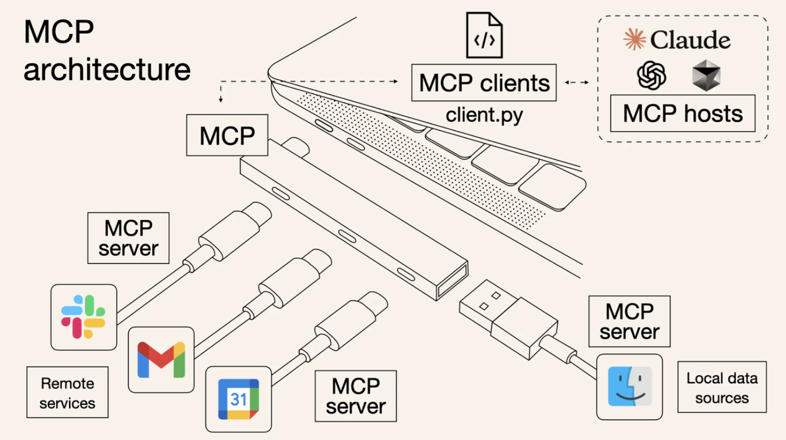

+++
title = "A Student’s Guide to Mastering the Model Context Protocol"
date = 2025-03-11
description = "Workflow is shifting. We are entering the era of **Agentic Development**, where AI isn’t just a chatbot. It’s a collaborator with “hands”."
[extra]
author = "Pranav V"
+++

As a student, you’re likely used to the standard stack: building a frontend, connecting it to a
FastAPI or Node.js backend, and querying a database. But the workflow is shifting. We are
entering the era of **Agentic Development**, where AI isn’t just a chatbot. It’s a collaborator
with “hands”.
The bridge making this possible is **MCP (Model Context Protocol)**. Think of it as a
universal “USB port” for AI. Instead of you manually copying and pasting documentation or
error logs, MCP allows the AI to plug directly into your file system, your browser, and your
tools.

Here are some examples of how you can use MCP chronologically through the lifecycle of a
project.

# 1. The Research & Coding Phase: Context7
The biggest hurdle when starting a project with a new framework (like Next.js 15 or a
specific LLM SDK) is hallucination. Standard AI models often suggest deprecated syntax or
“old” ways of doing things because their training data has a cutoff.
Context7 is an MCP server designed to solve this. Instead of the AI guessing how a library
works, Context7 allows the model to:
- **Resolve Library IDs**: Find the exact version of the package you are using.
- **Fetch Live Docs**: Pull the most recent, version-specific documentation directly into
your chat.
**The Workflow**: While writing your core logic, the AI uses Context7 to “read” the official
manual in real-time. This ensures the code you write at 2:00 AM actually runs the first time.

# 2. The Implementation Phase: Local Tooling
Once you move past snippets and start building a full repository, the AI needs to understand
the “big picture”. Normally, you’d have to explain your file structure. With MCP servers
configured for your local environment, the assistant can:
- **Inspect Files**: Read your package.json or requirements.txt to understand dependencies.
- **Query Databases**: Check if your schema migrations actually worked by looking at the local DB.

# 3. The Testing & Debugging Phase: Chrome DevTools MCP
After the code is written, the real “pain” begins: debugging. Does the “Submit” button
actually trigger the API? Why is that div overlapping the navbar?
**Chrome DevTools MCP** gives your AI agent direct access to the browser’s engine. Unlike
an AI that just looks at a screenshot, this MCP server provides:
- **Runtime Inspection**: The AI can inspect the DOM, check CSS styles, and view console logs in real-time to find why a script is failing.
- **Network Monitoring**: You can ask the AI, “Check the network tab—is the login request returning a 401 or a 500 error?” It can look at the actual headers and payloads.
- **Live Interaction**: You can tell the AI to “Click the signup button and tell me what
happens in the console,” allowing it to troubleshoot the exact state of your app as you
build it.

# The Future of Your Workflow
Adopting the Model Context Protocol isn't just about using a new tool; it’s about shifting
your mindset from writing code to architecting systems. The transition from manual “copy-paste” debugging to agentic development with MCP allows you to offload the work of
hunting for documentation or writing repetitive test scripts.
By integrating tools like Context7 for real-time accuracy and Chrome DevTools MCP for
live debugging, you are essentially building a custom “DevOps team” that lives inside your
IDE. This doesn't replace the need for strong foundational knowledge. You still need to
understand the logic, but it ensures that your time is spent solving interesting problems rather
than fighting outdated syntax or invisible browser errors.